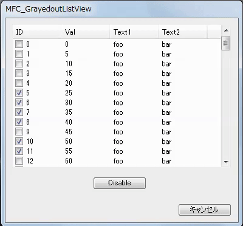

# GrayedOut ListView (MFC)

One Method for Gray-Out (Disable) of ListView

The listview control does not Grayed-Out when set disabled. 
This method shows the Grayed-Out listview "image" insted of actual listview.

## Process
1. Select the Disable button.
2. Capture current listview as a bitmap image.
3. Process the listview image to darker like it was disabled.
4. Hide the actual listview control.
5. Put listview image to the place of actual listview control.